# springboot-oracle-demo

    只包含OAuth2.0认证服务器端和资源服务器端，不包含OAuth2.0的客户端，客户端需要自己去实现。

#### 描述
    统一认证服务器，使用目前最流行的授权解决方案OAuth2.0；
    客户端主要通过授权码模式、密码模式、客户端凭证模式、隐式授权模式四种方式获取临时的令牌，最后通过令牌获得访问用户资源的权限。

#### 简单实现
    主要实现了OAuth2.0的统一认证、鉴权功能，但在最基础的功能上做了些改进：
    1.自定义的授权码code实现
    2.自定义的授权令牌token实现(JWT)
    3.授权码code、token等信息使用redis存储，并使用fastjson序列化
    4.扩展ClientDetails，添加trusted属性，对于受信任的client跳过用户授权操作
    5.不同的资源访问权限配置
    6.统一OAuth接口返回格式（包含异常处理）
    7.自定义登录界面实现（包含验证码）
    8.仿微信用户授权页面实现

#### 验证流程

1.  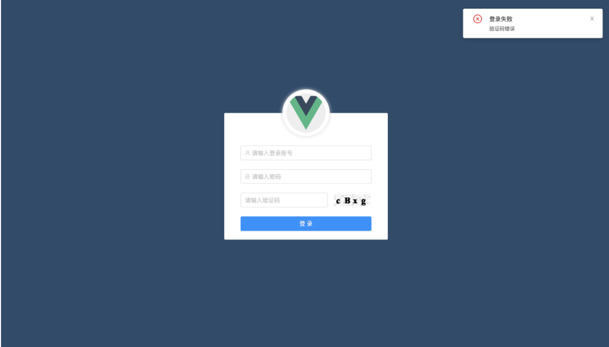
2.  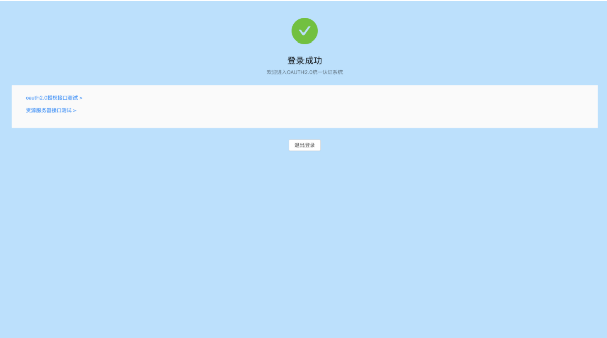
3.  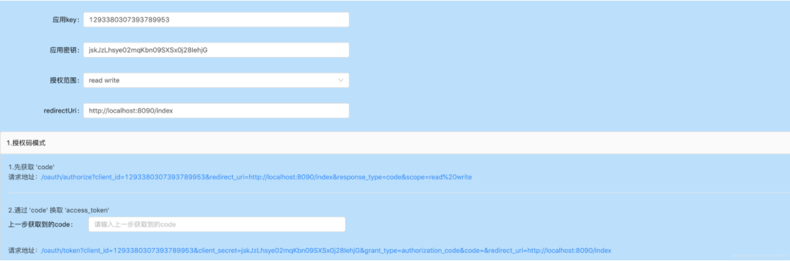
4.  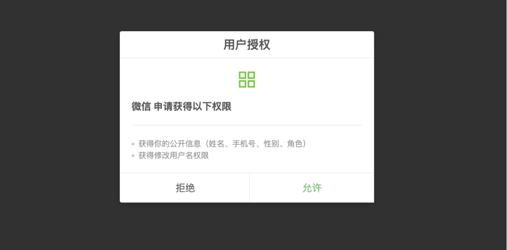
5.  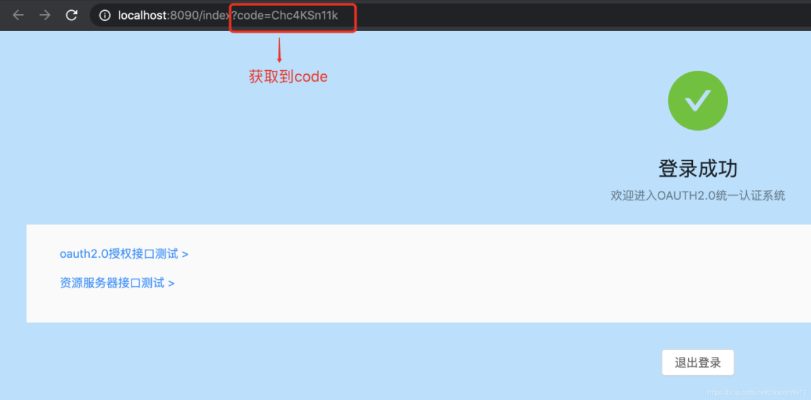
6.  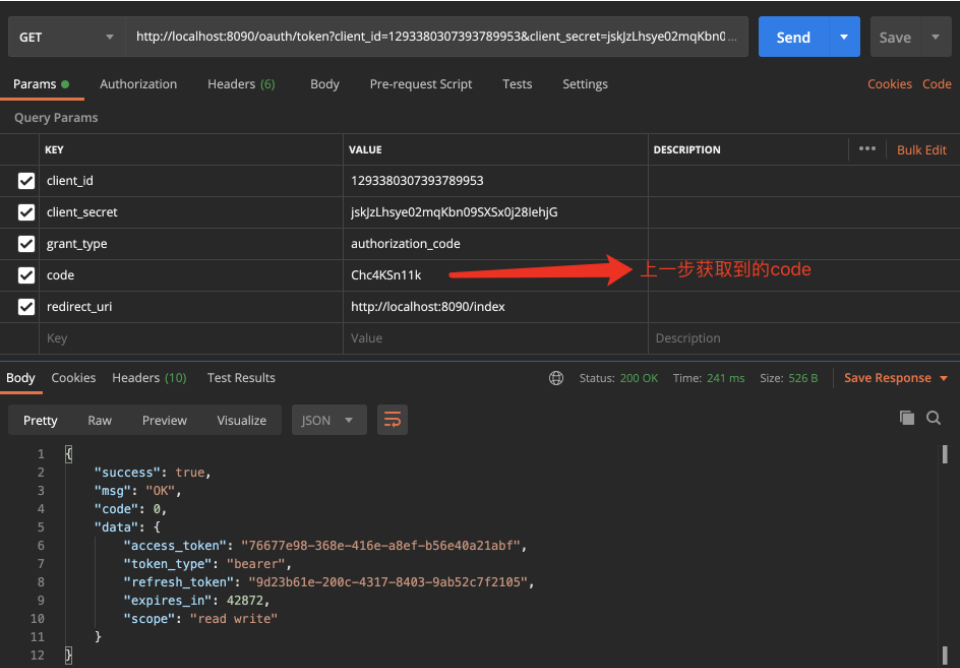
7.  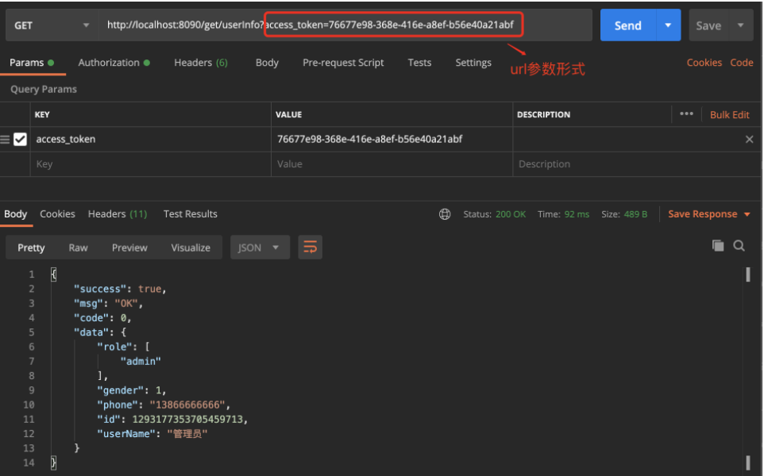
8.  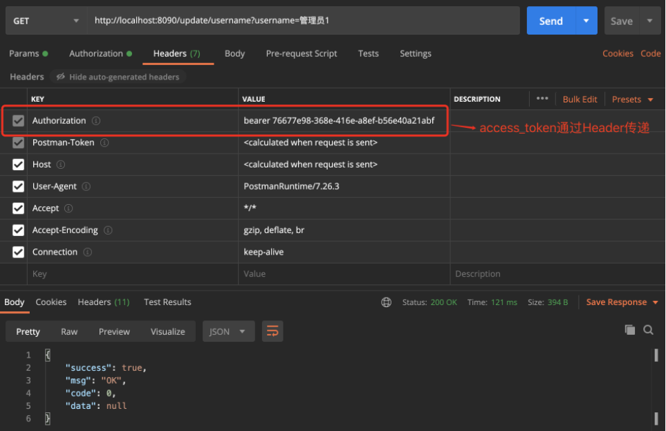
9.  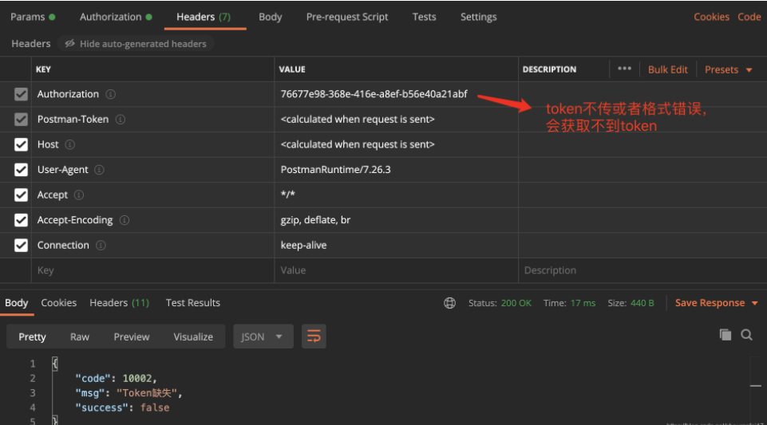
10. 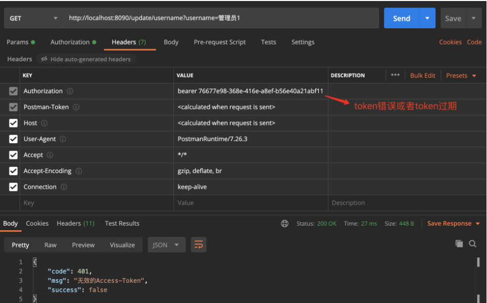
11. 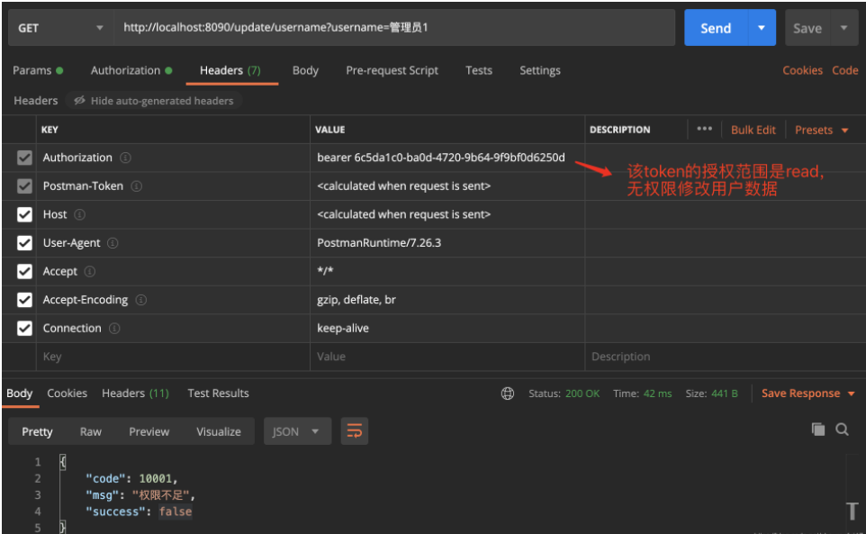

#### 表结构

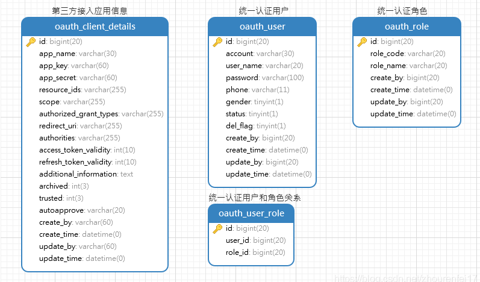

    表结构是spring-security-oauth2提供的默认字段，但是实际项目中我们可能不止包含这些字段，
    例如oauth_client_details中可能包含接入应用的名称、图片信息等。

#### 参考

    1.  https://www.oauth.com/
    2.  https://blog.csdn.net/monkeyking1987/article/details/16828059
    3.  https://projects.spring.io/spring-security-oauth/docs/oauth2.html

#### Gitee

    1.  码云地址:https://gitee.com/OneFlush/springboot-oracle-demo.git